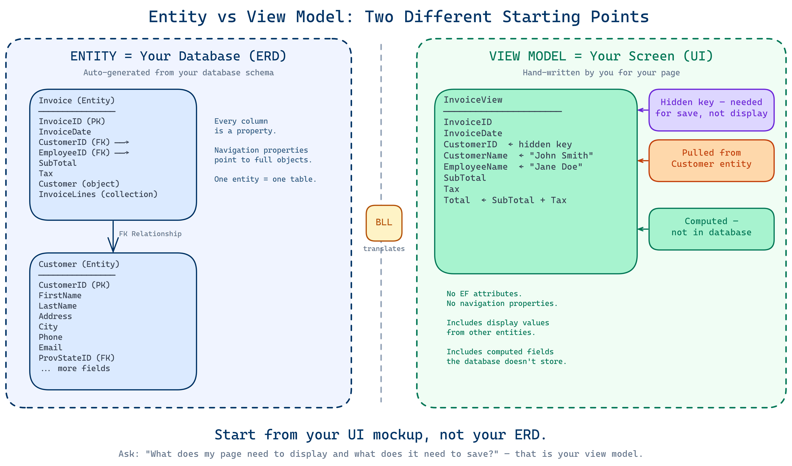
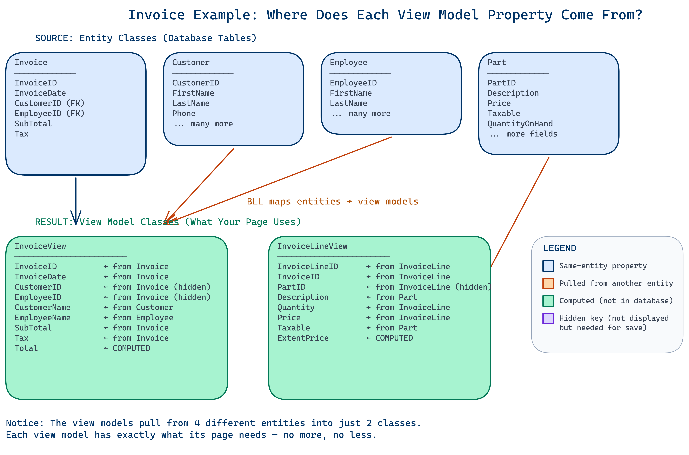
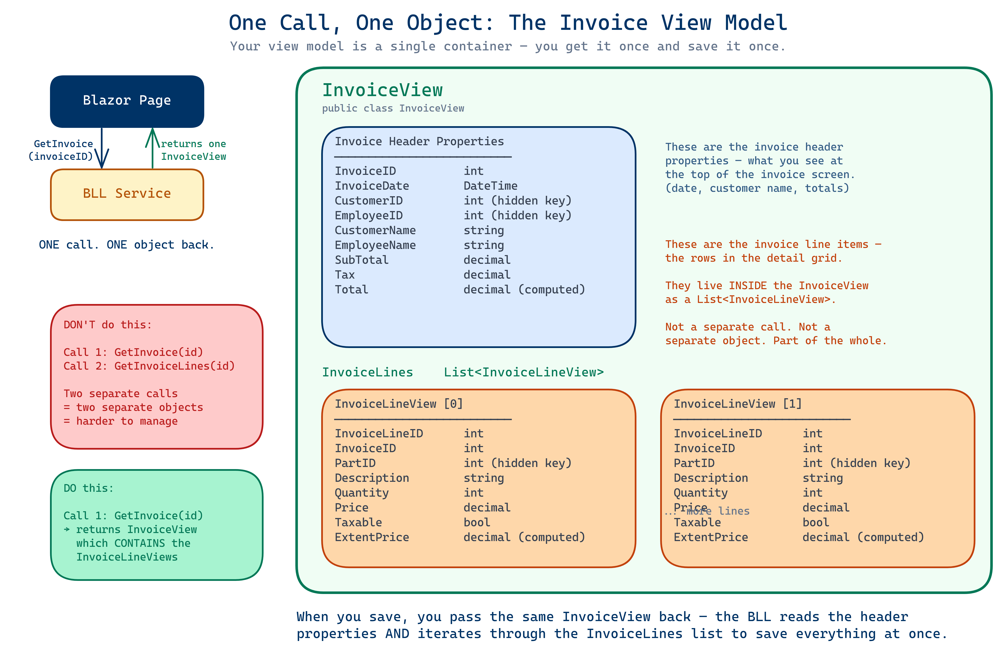
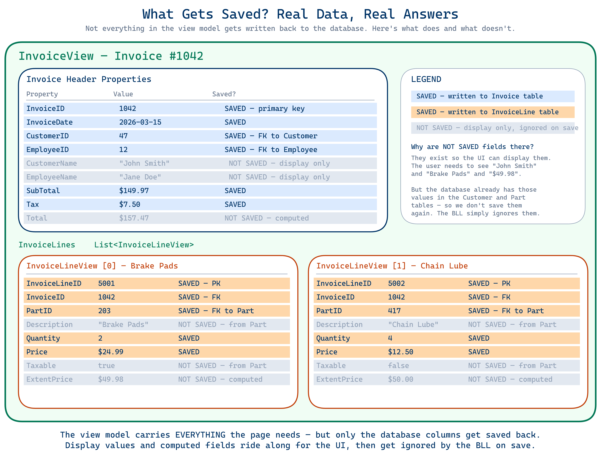

# Entities vs View Models: Understanding the Difference

**DMIT 2018 — Intermediate Application Development**

---

## The Core Problem

Many students look at the ERD (Entity Relationship Diagram) and try to build their view models to match it exactly. This is a fundamental misunderstanding of what each one is for.

**An entity represents how data is _stored_. A view model represents how data is _used_.**

These are two very different things.

---

## What Is an Entity?

An entity is a C# class that maps directly to a **database table**. It is auto-generated by EF Core Power Tools from your database schema.

Entities:
- Have one class per table
- Include every column from that table as a property
- Contain EF Core attributes (`[Table]`, `[Key]`, `[ForeignKey]`, etc.)
- Include navigation properties to related entities (`ICollection<T>` for one-to-many, object references for many-to-one)
- Are marked `internal` so the UI layer cannot access them directly
- Are **normalized** — data is not duplicated across tables

Think of entities as a mirror of your ERD in code. Each entity = one table. Each navigation property = one relationship line on the ERD.

---

## What Is a View Model?

A view model is a C# class that represents **what the user sees on screen** or **what a form collects from the user**. You design it yourself based on the needs of your page.

View models:
- Are `public` — they are what the UI layer works with
- Have no EF Core attributes — they are plain C# classes (POCOs)
- Can pull in values from **multiple entities** into a single class
- Can include **computed properties** that don't exist in the database
- Can **omit properties** that the UI doesn't need
- Can contain **lists of other view models** for master/detail screens

Think of a view model as what you would sketch on a whiteboard if someone asked "what data does this page need?"

> **Already taken DMIT 2028 (System Analysis and Design 2)?** If so, you may recognize that a view model is essentially what a **class diagram** represents — an object designed for your application, not your database. Your entities come from the ERD. Your view models come from a class diagram based on what your UI needs. If you haven't taken that course yet, don't worry — everything below will make this clear without that background.



---

## The Invoice Example

This is the clearest way to see the difference. Let's look at how invoices work in the HogWild system.

### The Entity Side (Database)

The database has two tables — `Invoice` and `InvoiceLine` — connected by a foreign key. The entities look like this:

**Invoice entity:**
| Property | Type | Notes |
|----------|------|-------|
| InvoiceID | int | Primary key |
| InvoiceDate | DateTime | |
| CustomerID | int | Foreign key |
| EmployeeID | int | Foreign key |
| SubTotal | decimal | |
| Tax | decimal | |
| RemoveFromViewFlag | bool | Soft delete |
| Customer | Customer | Navigation property (object) |
| Employee | Employee | Navigation property (object) |
| InvoiceLines | ICollection\<InvoiceLine\> | Navigation property (collection) |

**InvoiceLine entity:**
| Property | Type | Notes |
|----------|------|-------|
| InvoiceLineID | int | Primary key |
| InvoiceID | int | Foreign key |
| PartID | int | Foreign key |
| Quantity | int | |
| Price | decimal | |
| RemoveFromViewFlag | bool | Soft delete |
| Invoice | Invoice | Navigation property (object) |
| Part | Part | Navigation property (object) |

Notice the entity stores `CustomerID` and `EmployeeID` as integers. It stores `PartID` as an integer. It has navigation properties that are full objects pointing to other entities. This is all about **how the database stores and connects data**.

### The View Model Side (What the User Sees)

Now think about what an invoice screen actually needs to display:

**InvoiceView:**
| Property | Type | Notes |
|----------|------|-------|
| InvoiceID | int | Identifier |
| InvoiceDate | DateTime | |
| CustomerID | int | For lookups |
| EmployeeID | int | For lookups |
| **CustomerName** | **string** | **Pulled from the Customer entity** |
| **EmployeeName** | **string** | **Pulled from the Employee entity** |
| SubTotal | decimal | |
| Tax | decimal | |
| **Total** | **decimal** | **Computed: SubTotal + Tax** |

**InvoiceLineView:**
| Property | Type | Notes |
|----------|------|-------|
| InvoiceLineID | int | Identifier |
| InvoiceID | int | |
| PartID | int | |
| **Description** | **string** | **Pulled from the Part entity** |
| Quantity | int | |
| Price | decimal | |
| **Taxable** | **bool** | **Pulled from the Part entity** |
| **ExtentPrice** | **decimal** | **Computed: Price x Quantity** |

Look at the differences:

1. **`CustomerName` and `EmployeeName`** — The entity stores `CustomerID` (an integer) and has a navigation property to the full `Customer` object. The view model just needs the name as a string. The user doesn't need to see the Customer object — they need to see "John Smith."

2. **`Total`** — This field does not exist in the database. It's calculated as `SubTotal + Tax`. The view model computes it on the fly using an expression body: `public decimal Total => SubTotal + Tax;`

3. **`Description` and `Taxable`** — These come from the `Part` entity, not the `InvoiceLine` entity. The view model pulls in values from multiple tables into one class because that's what the screen needs to show.

4. **`ExtentPrice`** — Also computed: `public decimal ExtentPrice => Price * Quantity;` This value is never stored in the database.

5. **No navigation properties** — The view model doesn't have `Customer`, `Employee`, or `Part` objects. It has the specific pieces of information it needs from those objects.

The diagram below shows this in action — four source entities at the top, two view models at the bottom, with each property traced back to where it comes from:



---

## The Three Key Patterns

### Pattern 1: Replace Objects with the Values You Need

Your entity stores a `CustomerID` because the database only needs a number to find the right row. It also has a navigation property — a full `Customer` object — so Entity Framework can follow that relationship.

But your user doesn't want to see `47` on their invoice. They want to see **"John Smith."**

So in your view model, you skip the object and just hold the value you actually need to display:

| Entity has... | View Model has... |
|---------------|-------------------|
| `CustomerID` (int) + `Customer` (object) | `CustomerID` (int) + `CustomerName` (string) |
| `PartID` (int) + `Part` (object) | `PartID` (int) + `Description` (string) + `Taxable` (bool) |
| `ProvStateID` (int) + `ProvState` (object) | `ProvStateID` (int) or a display string |

The entity has the whole `Customer` object because it needs to navigate relationships in the database. Your view model doesn't need that — it just needs the customer's name as a string. The entity has the whole `Part` object, but your invoice line view model only needs the part's description and whether it's taxable.

**Ask yourself:** "What value from this related table does my page actually display?" Put *that* in your view model — not the whole object.

> **Important: Always include the primary key — even if the user never sees it.**
>
> Look at the table above. Notice that `CustomerID` and `PartID` are still in the view model even though the user sees "John Smith" and a part description — not ID numbers.
>
> Why? Because you need those keys to **save data back to the database**.
>
> Think about an invoice line. The screen might show the part's description, quantity, and price — the user never sees a `PartID`. But when you save that invoice line, the database needs to know *which part* this line is for. Without the `PartID` in your view model, you have no way to link it back.
>
> The same applies to any list. If you display a list of customers showing only their name and phone number, you still need `CustomerID` in the view model. When the user selects a customer from that list, you need the ID to go fetch the full customer record.
>
> **Your view model includes what's needed to _display_ the data AND what's needed to _work with_ the data.** A key that isn't shown on screen is still required if it's used for lookups, saves, or linking records together.

### Pattern 2: Computed Properties

Add fields the database doesn't store but the UI needs to display.

| Computed Property | Formula |
|-------------------|---------|
| `Total` | `SubTotal + Tax` |
| `ExtentPrice` | `Price * Quantity` |
| `Outstanding` | `OrderQuantity - QuantityReceived - QuantityReturned` |
| `GST` | `SubTotal * 0.05m` |

These use expression bodies (`=>`) so they always recalculate automatically.

### Pattern 3: Composition (Master/Detail)

A view model can contain a list of other view models to represent a parent-child screen.

For example, a purchase order screen needs:
- The PO header information (order number, date, vendor)
- A list of line items (parts, quantities, prices)
- Computed totals

A single view model can hold all of this:

```
PurchaseOrderView
   ├── PurchaseOrderID
   ├── OrderDate
   ├── VendorName          ← pulled from Vendor
   ├── SubTotal
   ├── TaxAmount
   ├── Total               ← computed
   └── Details: List<PurchaseOrderDetailView>
           ├── PartID
           ├── Description     ← pulled from Part
           ├── Quantity
           ├── PurchasePrice
           └── ExtPrice        ← computed
```

This is **not** an ERD. There is no foreign key relationship between `PurchaseOrderView` and `PurchaseOrderDetailView`. It's a container that holds everything the page needs in one place.

**The key insight: one call, one object.** When your Blazor page calls the BLL to get an invoice, it makes a single call — `GetInvoice(invoiceID)` — and gets back one `InvoiceView` that already contains the invoice lines inside it as a `List<InvoiceLineView>`. You don't make a separate call to get the lines. When you save, you pass the same `InvoiceView` back to the BLL — it contains the header properties and the line items, and the BLL saves everything at once.



But here's the important follow-up question: **when you save that InvoiceView back, does everything in it get written to the database?** No. The view model carries everything the page needs to *display*, but only the actual database columns get *saved*. Display values like `CustomerName` and computed fields like `Total` and `ExtentPrice` are ignored by the BLL on save — the database already has those values in the Customer and Part tables, and computed values are recalculated every time.

The diagram below shows a real InvoiceView with sample data. Every field is marked as either **SAVED** (written to the database) or **NOT SAVED** (display only — ignored on save):



---

## Side-by-Side Comparison

| | Entity | View Model |
|---|--------|------------|
| **Represents** | A database table | A screen or form |
| **Created by** | EF Core Power Tools (auto-generated) | You (hand-written) |
| **Access** | `internal` | `public` |
| **Attributes** | `[Table]`, `[Key]`, `[ForeignKey]`, etc. | None |
| **Relationships** | Navigation properties (`ICollection<T>`) | Lists of child view models or none |
| **Computed fields** | Rarely | Frequently (`=>` expressions) |
| **Data source** | One table | One or more tables |
| **Used by** | Entity Framework / BLL | Blazor pages / UI components |

---

## The Common Mistake

Students who treat view models like entities will:

- Create a view model that looks exactly like the entity (same properties, same structure)
- Use navigation properties in view models (`public Customer Customer { get; set; }`)
- Forget to add computed fields that the UI needs
- Create separate view models where one composite view model would serve the page better
- Try to add EF Core attributes to view models

**The question to ask yourself is not** "What does my database table look like?"

**The question to ask yourself is** "What does my page need to display, and what does the user need to enter?"

Start from the UI mockup. List out every piece of data shown on screen. That's your view model.

---

## How They Connect

Entities and view models are connected through the **Business Logic Layer (BLL)**. Your service methods:

1. **Query** entities from the database using Entity Framework
2. **Map** entity data into view model properties (pulling in display values and computing totals)
3. **Return** view models to the UI layer

When saving data, the reverse happens:

1. **Receive** a view model from the UI
2. **Map** view model properties back to entity properties
3. **Save** the entity to the database

The BLL is the translator between the two worlds.

---

## Quick Checklist

Before you finalize a view model, ask yourself:

- [ ] Does this view model contain everything my page needs to display?
- [ ] Have I replaced navigation properties with the actual display values I need (e.g., `CustomerName` instead of `Customer` object)?
- [ ] Have I included primary keys (even if they're not displayed) so I can save, look up, and link records?
- [ ] Have I added computed properties for calculated fields (totals, extended prices)?
- [ ] If this is a master/detail page, does my view model contain a `List<T>` of the detail view model?
- [ ] Have I removed properties that my page doesn't actually use?
- [ ] Is my view model `public` with no EF Core attributes?
- [ ] Is this designed around my **UI needs**, not my **database structure**?

If you can check all of these, your view model is on the right track.
